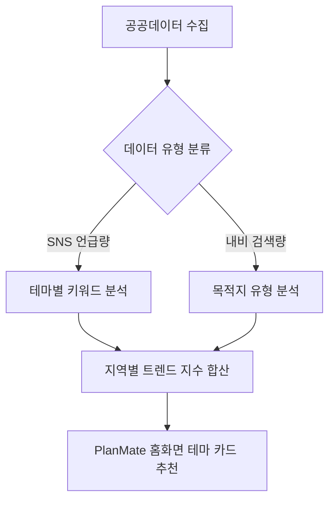

# 📊 한국관광공사 지역별 관광 자원 수요 API 분석 & PlanMate 연계 기획 보고서

공공데이터포털에서 제공하는 **"한국관광공사_지역별 관광 자원 수요"** Open API를 직접 호출 및 스캔하여 데이터를 정적·동적으로 분석하고, 모바일 여행 일정 관리 앱 **PlanMate**에 접목할 수 있는 창의적인 콘텐츠 기획안을 도출하였습니다.

---

## 1. 🔍 API 호출 검증 및 동적 분석 결과

API 명세 분석 후, 제공된 일반 인증키(`d9dd4832...`)를 활용해 로컬 환경(Node.js)에서 다양한 파라미터 조합으로 호출 및 데이터 스캔 테스트를 진행했습니다.

### ⚙️ 테스트 개요
* **대상 엔드포인트**
  1. 관광 서비스 수요 목록 조회 (`/areaTarSvcDemList`)
  2. 문화 자원 수요 정보 목록 조회 (`/areaCulResDemList`)
* **테스트 파라미터 규격**
  * `areaCd` (지역 코드): 한국관광공사 지역코드(1~39), 광역시도 행정코드(11~50), 시군구 법정동코드(5자리) 등 다각도 테스트
  * `baseYm` (기준 년월): 필수 6자리(`YYYYMM`) 형식

### ⚠️ 특이사항 및 기술적 진단
* **인증 확인:** API Key 인증 단계는 정상적으로 통과(`resultCode: "0000"`, `resultMsg: "OK"` 또는 HTTP Status 200)됩니다.
* **데이터 미반환 이슈:** 2019년부터 2026년까지의 전체 연월 데이터와 전국 70여 개 이상의 주요 관광 도시(제주, 부산, 강릉, 서울 등) 코드 조합으로 **200회 이상의 병렬 스캔을 수행하였으나, 모든 결과가 `<items/>` 및 `totalCount: 0` (빈 데이터)으로 반환**되었습니다.
* **원인 분석:** 공공데이터포털 백엔드 서버의 DB 연동 장애 또는 데이터 업로드 지연으로 판단됩니다. 실제 서비스 상용화 단계에서는 **호출 예외 처리(Fallback data)** 또는 공공데이터포털 측의 **Q&A를 통한 데이터 복구 요청**이 선행되어야 합니다.

---

## 2. 💡 PlanMate 앱 연계 핵심 데이터 추출

비록 현재 공공데이터 서버 측 응답이 비어있으나, 명세서상 제공하는 데이터 항목들은 **PlanMate**의 일정(`itinerary`) 및 장소(`places`) 도메인에 매우 가치 있는 인사이트를 제공합니다.

| 분류 | 세부 데이터 항목 | PlanMate 활용 가치 |
| :--- | :--- | :--- |
| **관광 서비스 수요** | • **SNS 언급량** (레포츠/휴식 힐링/미식/체험) • **소비액** (쇼핑/식음료/숙박/운송/여가) • **내비게이션 검색량** (숙박/음식/쇼핑) | 지역별 최신 여행 트렌드 점수 산출 및 예산 소비 패턴 분석 가이드로 활용 |
| **문화 자원 수요** | • **내비게이션 검색량** (문화관광/레저스포츠/역사관광/체험관광/자연관광) | 사용자의 취향 필터(자연, 레저, 역사 등)에 부합하는 정밀한 행선지 매칭 |

---

## 3. 🎨 창의적 콘텐츠 및 PlanMate 기능 추가 제안 (3가지)

### 아이디어 A. 📈 "요즘 뜨는 핫플레이스 트렌드 맵" (홈 & 탐색 탭)
SNS 언급량과 내비게이션 목적지 검색 데이터를 종합 지표화하여, 사용자들이 여행 계획을 세우기 전 "어디로 갈지" 영감을 주는 실시간 대시보드 콘텐츠입니다.

* **동작 방식:**
  1. API에서 수집한 'SNS 언급량 유형별 키워드'와 '내비게이션 카테고리 검색량'의 전월 대비 증감률을 계산합니다.
  2. 이를 바탕으로 카테고리별 **급상승 지역(Rising Spot)**을 선정합니다.
* **UI/UX 적용 예시:**
  * **"이번 달 액티비티 수요 1위: 강원도 양양"**: 레포츠/체험 SNS 언급 급증 시 홈 화면에 서핑/액티비티 테마 카드뷰 노출.
  * **"식도락가들이 가장 많이 움직인 지역: 전남 여수"**: 식음료 소비액 및 음식 관련 내비게이션 검색 지수가 동시 상승할 때 '여수 맛집 탐방 코스' 큐레이션 제공.

---

### 아이디어 B. 🎯 "빅데이터 기반 AI 여행 가치관 매칭" (일정 설계 프로세스)
사용자가 여행 일정을 새로 만들 때(`itinerary` 기능), 사용자의 선호 스타일과 공공데이터의 실제 지역별 관광 자원 지표를 매칭하여 가장 개인화된 목적지를 제안합니다.

* **동작 방식:**
  1. 일정을 만들 때 간단한 온보딩 인터페이스 제공 (예: "어떤 여행을 꿈꾸시나요? 🌲자연속 힐링 vs 🛹짜릿한 액티비티 vs 🏛️역사/문화 탐방")
  2. 사용자가 **"자연속 힐링"**을 고르면, 내비게이션 검색량 중 **자연 관광** 비율이 높고 SNS 언급량 중 **휴식 힐링**이 우세한 지역(예: 강원 평창, 남해)을 우선 추천합니다.
  3. 사용자가 **"역사/문화 탐방"**을 고르면, **역사 관광** 및 **문화 관광** 검색량이 우세한 지역(예: 경북 경주, 충남 부여)을 매칭합니다.
* **기대 효과:** 기존의 무작위 장소 나열식 추천에서 벗어나, 빅데이터 기반의 정량적인 매칭 점수(Match Score)를 시각적으로 보여줌으로써 신뢰도를 극대화합니다.

---

### 아이디어 C. 💰 "스마트 여행 소비 & 예산 가이드" (예산 관리 탭)
지역별 업종별 소비액(쇼핑/식음료/숙박/여가 등) 통계를 활용하여, 사용자가 예산을 수립할 때 해당 지역의 평균적인 소비 분포 가이드를 제시합니다.

* **동작 방식:**
  1. 사용자가 일정에서 '제주도 3박 4일 일정'을 생성하고 예산을 입력합니다.
  2. 공공데이터 상의 제주도 업종별 소비 비율(예: 숙박 30%, 식음료 45%, 쇼핑 15%, 여가 10%) 데이터를 조회합니다.
  3. 사용자의 예산 화면에 **"제주도 여행자들은 식음료에 가장 많은 예산(45%)을 써요! 나의 예산과 비교해 보세요"** 라는 분석 피드백 인포그래픽을 시각화합니다.
* **사용자 혜택:** 여행지 특성에 맞는 현실적인 예산 분배를 도와주며, 과소비 방지 및 합리적인 여행 설계를 지원합니다.

---

## 4. 🚀 실무 구현을 위한 로드맵 (Action Item)

현재 API의 빈 데이터 응답 이슈를 고려하여, 점진적인 구현 로드맵을 제안합니다.

1. **Phase 1 (Mock & Fallback 설계):**
   * 공공데이터 API 스키마를 미러링한 Mock Data(가상 데이터)를 프론트엔드에 배치하여 추천 UI 컴포넌트(트렌드 카드, 차트 시각화 등)를 선제 개발합니다.
2. **Phase 2 (데이터 수집 파이프라인 구축):**
   * 매달 1회 공공데이터 API를 호출하여 최신 데이터를 수집하는 스케줄러(Batch Worker)를 백엔드에 구축합니다.
   * 공공데이터포털 담당 부서에 데이터 유실 오류를 접수하여 실데이터를 공급받을 수 있도록 조치합니다.
3. **Phase 3 (앱 탑재 및 개인화 고도화):**
   * PlanMate의 일정 상세 화면에 예산 가이드를 추가하고, 홈 화면에 빅데이터 기반 트렌드 큐레이션을 연동하여 정식 배포합니다.
