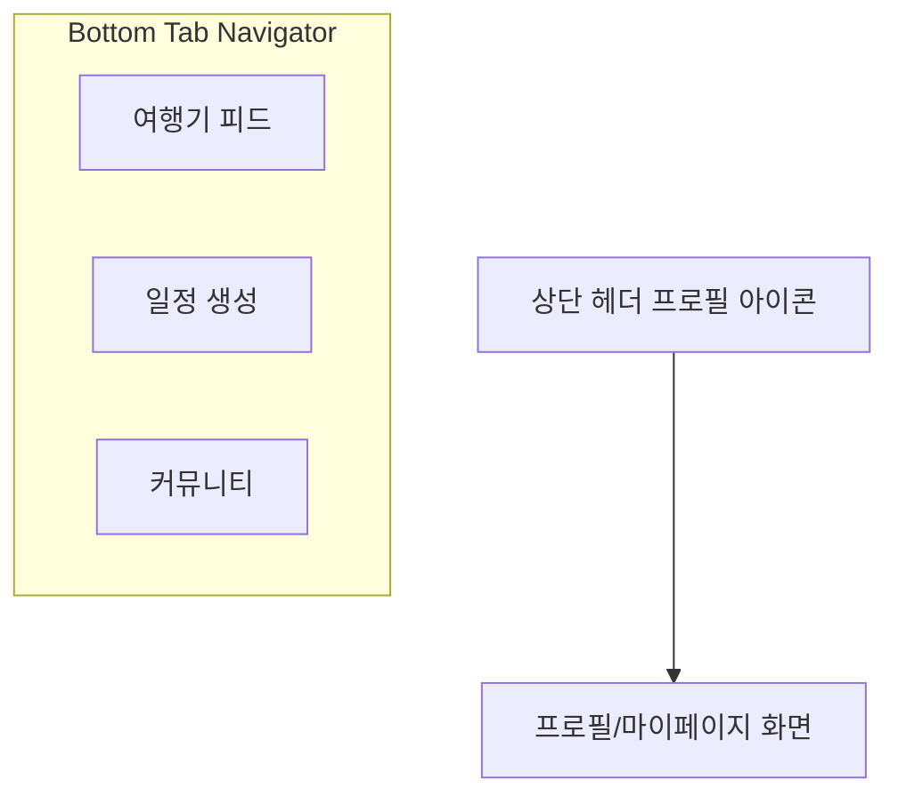

# 📱 모바일 네비게이터 구조 개선 및 웹 통일성 제안

현재 모바일의 하단 탭 구조와 웹의 헤더 메뉴 구조를 비교하여, 두 플랫폼 간 일관된 사용자 경험(UX)을 주면서 모바일 사용성을 극대화하기 위한 구조 개선안을 제안합니다.

---

## 📊 현재 구조 비교

| 플랫폼 | 주요 네비게이션 항목 (메인 메뉴) | 프로필 / 설정 접근 방식 |
| :--- | :--- | :--- |
| **웹 (Web)** | `여행기 피드` \| `커뮤니티` \| `일정 생성` | 우측 상단 프로필 아바타 (드롭다운) |
| **모바일 (Mobile)** | `일정 (MySchedule)` \| `커뮤니티` \| `프로필` | 하단 독립 탭 (`ProfileTab`) |

---

## 💡 네비게이터 변경 제안: **피드, 일정 생성, 커뮤니티로 변경 (강력 추천)**

웹과 동일하게 **피드(Feed), 일정 생성(Planner/Schedule), 커뮤니티(Community)**의 3대 핵심 가치 중심으로 탭을 재편하는 안을 제안합니다.



### 1. 웹과의 일관성 (Omnichannel Consistency)
* 사용자가 웹과 모바일을 오갈 때 동일한 서비스 정체성(**"남의 여행기를 보고(피드), 내 일정을 짜고(생성), 소통한다(커뮤니티)"**)을 느끼게 됩니다.
* 현재 모바일 첫 화면은 비어있을 수 있는 '내 일정' 리스트인데, 이를 **'여행기 피드'**로 변경하면 앱을 켜자마자 풍부한 콘텐츠를 탐색할 수 있어 초기 진입 장벽을 대폭 낮추고 사용자 체류 시간을 늘립니다.

### 2. 프로필 탭의 위치 조정 (헤더 영역으로 이동)
* 테마 설정, 비밀번호 변경 등 프로필/설정 기능은 사용 빈도가 매우 낮습니다. 이를 모바일 화면에서 가장 중요한 영역인 하단 탭 바에 항상 노출하는 것은 아깝습니다.
* **대안**: 웹과 마찬가지로 화면 우측 상단 헤더에 **동그란 프로필 아바타 아이콘**을 배치하고, 이를 터치하면 기존 프로필 스택(`ProfileScreen`)으로 이동시키는 구조가 최신 모바일 앱 트렌드(예: Airbnb, Notion, GitHub, Twitter 등)에 부합합니다.

### 3. '일정 생성'의 중요도 강조
* planMate의 핵심 킬러 기능인 **AI 기반 일정 생성** 기능을 독립된 메인 탭으로 빼내어 접근성을 높입니다.

---

## 🛠️ 모바일 코드 수정 방향

이 구조로 개편하기 위해 수정해야 할 모바일 파일 목록과 변경 로직 설계입니다.

### 1. [types.ts](file:///C:/Users/min30/dev/planm/App/Mobile/src/navigation/types.ts)
- `TabParamList`를 웹과 대칭되도록 수정합니다.
```typescript
export type TabParamList = {
  FeedTab: undefined;        // 여행기 피드 (신설)
  ScheduleTab: undefined;    // 일정 생성 및 관리
  CommunityTab: undefined;   // 커뮤니티
};
```

### 2. [AppStack.tsx](file:///C:/Users/min30/dev/planm/App/Mobile/src/navigation/AppStack.tsx)
- 하단 탭 내비게이터를 `FeedTab`, `ScheduleTab`, `CommunityTab`으로 변경합니다.
- `ProfileStack`은 하단 탭에서 제거하고, 전체 스택 네비게이터(`AppStack`) 내에 일반 스크린으로 등록하여 헤더 버튼을 클릭했을 때 `navigate('Profile')`로 접근하도록 변경합니다.
- 첫 화면이 될 `FeedStack`을 신규 생성하고, 이미 구현되어 있는 [TravelFeedList.tsx](file:///C:/Users/min30/dev/planm/App/Mobile/src/features/itinerary/components/TravelFeedList.tsx) 컴포넌트를 연동합니다.

---

> [!TIP]
> **결론**: 모바일 하단 탭을 **피드, 일정 생성, 커뮤니티**의 3-Tab 체제로 개편하는 것은 웹과의 통일성을 높이고, 콘텐츠 탐색률을 극대화하며, 빈도가 낮은 프로필 설정을 헤더로 깔끔하게 정리할 수 있는 **매우 훌륭한 디자인 전략**입니다.
